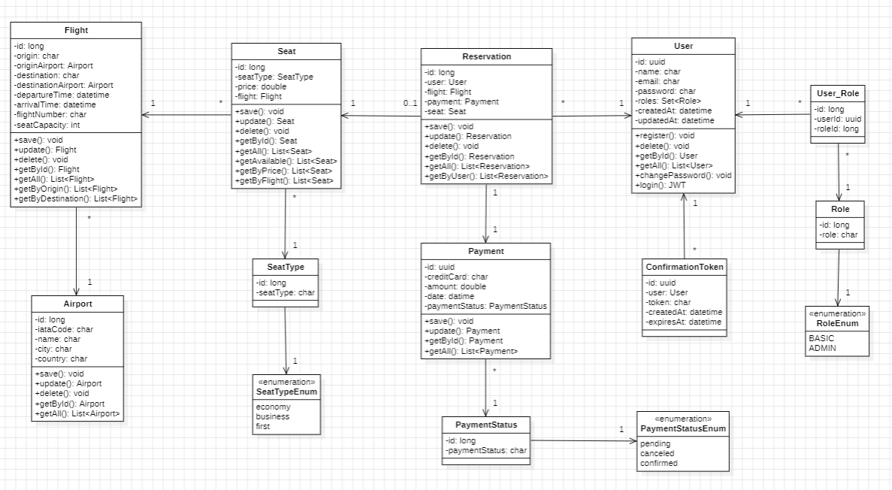

# API REST para reservas aéreas

    

Seja bem vindo(a) ao meu projeto de **API REST para reservas aéreas**. O serviço (fictício), chamado Amarelo, usará este projeto para o backend.

## Tabela de conteúdos

- [Introdução](#introdução)
- [Funcionalidades](#funcionalidades)
- [Diagrama de classes](#diagrama-de-classes)
- [Tecnologias](#tecnologias)
- [Iniciando](#iniciando)
- [Configuração](#configuração)
- [Uso](#uso)
- [Endpoints](#endpoints)
- [Contribuições](#contribuições)
- [Contato](#contato)

## Introdução

Este projeto foi desenvolvido para um trabalho acadêmico em Análise Orientada a Objetos (AOO), como conclusão da disciplina. A API implementa autenticação com JWTs, autorização por meio de roles para os usuários, criptografia das informações de pagamento, utilizando as melhores e mais atualizadas práticas do mercado para assegurar a integridade dos dados sensíveis e endpoints para manipulação das entidades que, além de permitirem a reserva dos voos, validam entradas e regras de negócio.

## Funcionalidades

- Envio de email para confirmação de cadastro dos usuários.
- Buscas utilizando paginação.
- Documentação com endpoints utilizando Swagger.
- Login de usuários com autenticação através de JWT.
- Autorização com roles para o controle de acesso de diferentes endpoints da API. 
- Senhas criptografadas utilizando as melhores práticas da indústria.
- Integração com o banco de dados MySQL.

## Diagrama de classes

## Tecnologias

- : Linguagem de programação.
- : Framework usado para a construção de aplicações.
- : Framework para segurança de aplicações Spring.
- : Banco de dados relacional.

## Configuração

- Antes de iniciar a aplicação, atualize o arquivo `application.properties` com todas informações necessárias.

## Iniciando

Siga esses passos para executar o projeto na sua máquina (necessário ter o docker instalado):

1. Clone o repositório: `git clone https://github.com/gabrieudev/amarelo.git`
2. Navegue para o diretório do projeto: `cd <caminho>`
3. Construa o projeto: `./mvnw clean install` (para Windows: `mvnw.cmd clean install`)
4. Execute a aplicação: `./mvnw spring-boot:run` (para Windows: `mvnw.cmd spring-boot:run`)

## Uso

1. Ao iniciar o projeto, um usuário com a role de administrador é inserido no banco de dados automaticamente em `AdminDataLoader.java`. Suas informações podem ser alteradas tanto lá, quanto em `application.properties`.
2. Utilize um usuário com role de administrador para ter acesso aos endpoints protegidos.

## Endpoints

Airport:

- `ADMIN Role` `POST /airports`: Salva um aeroporto.
- `BASIC Role` `GET /airports/{id}`: Obtém um aeroporto por id.
- `BASIC Role` `GET /airports`: Obtém todos aeroportos.
- `ADMIN Role` `PUT /airports/{id}`: Atualiza um aeroporto.
- `ADMIN Role` `DELETE /airports/{id}`: Deleta um aeroporto.

Flight:

- `ADMIN Role` `POST /flights`: Salva um voo.
- `BASIC Role` `GET /flights/{id}`: Obtém um voo por id.
- `BASIC Role` `GET /flights`: Obtém todos voos.
- `ADMIN Role` `PUT /flights/{id}`: Atualiza um voo.
- `ADMIN Role` `DELETE /flights/{id}`: Deleta um voo.

Seat:

- `ADMIN Role` `POST /seats`: Salva um assento.
- `BASIC Role` `GET /seats/{id}`: Obtém um assento por id.
- `BASIC Role` `GET /seats`: Obtém todos assentos.
- `ADMIN Role` `PUT /seats/{id}`: Atualiza um assento.
- `ADMIN Role` `DELETE /seats/{id}`: Deleta um assento.
- `BASIC Role` `GET /seats/available/{flightId}`: Obtém todos os assentos disponíveis de um voo.
- `BASIC Role` `GET /seats/available/{flightId}/{min}/{max}`: Obtém todos os assentos disponíveis de um voo, de acordo com o preço.

Reservation:

- `BASIC Role` `POST /reservations`: Salva uma reserva.
- `BASIC Role` `GET /reservations/{id}`: Obtém uma reserva por id.
- `ADMIN Role` `GET /reservations`: Obtém todas reservas.
- `BASIC Role` `PUT /reservations/{id}`: Atualiza uma reserva.
- `BASIC Role` `DELETE /reservations/{id}`: Deleta uma reserva.
- `BASIC Role` `GET /reservations/by-user/{userId}`: Obtém todas as reservas de um usuário.

Payment:

- `BASIC Role` `GET /payments/{id}`: Obtém um pagamento por id.
- `ADMIN Role` `GET /payments`: Obtém todos pagamentos.
- `BASIC Role` `PUT /payments/{id}`: Atualiza um pagamento.
- `ADMIN Role` `DELETE /payments/{id}`: Deleta um pagamento.

User:

- `POST /auth/register`: Registra um usuário e envia um link para confirmação ao seu email.
- `GET /users/confirm`: Faz a verificação do email.
- `POST /auth/login`: Realiza o login e recebe um JWT.
- `ADMIN Role` `GET /users`: Obtém todos usuários.
- `ADMIN Role` `DELETE /users/{userId}`: Deleta um usuário.
- `BASIC Role` `GET /users/{userId}`: Obtém um usuário de acordo com o ID.
- `BASIC Role` `POST /users/change-password`: Muda a senha de um usuário.

Acesse a documentação completa no endpoint `/swagger-ui.html`

## Contribuições

Contribuições são muito bem vindas! Caso queira contribuir, faça um fork do repositório e crie um pull request.

## Contato

Caso tenha alguma sugestão ou dúvida, entre em contato comigo em [LinkedIn](https://www.linkedin.com/in/gabrieudev)

---

**Licença:** Esse projeto é licenciado sob os termos da [GNU General Public License (GPL)](LICENSE).
